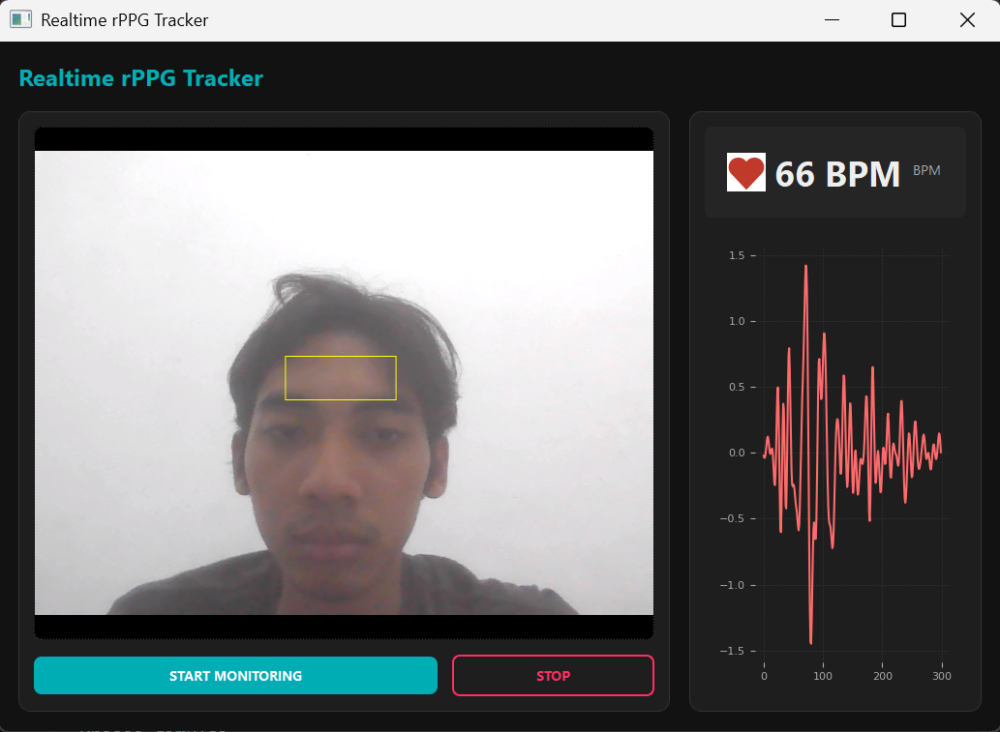

# Realtime rPPG Tracker

Aplikasi berbasis Python yang mengestimasi Detak Jantung (BPM) dari video wajah secara real-time menggunakan Remote Photoplethysmography (rPPG). Proyek ini memanfaatkan teknik Computer Vision dan Pemrosesan Sinyal untuk mendeteksi variasi warna halus pada kulit yang disebabkan oleh sirkulasi darah.

## Fitur

-   **Deteksi Wajah Real-time**: Menggunakan MediaPipe untuk deteksi wajah yang cepat dan akurat.
-   **Pemantauan Tanda Vital Tanpa Kontak**: Mengestimasi Detak Jantung tanpa sensor fisik apa pun.
-   **Pemrosesan Sinyal yang Kuat (Robust)**:
    -   **Normalisasi Kromatisitas Hijau**: Tahan terhadap perubahan pencahayaan dan bayangan.
    -   **Standardisasi Sinyal**: Menangani artefak gerakan dan variasi amplitudo.
    -   **Bandpass Filtering**: Mengisolasi pita frekuensi detak jantung (0.67 - 4.0 Hz).
    -   **Analisis FFT**: Estimasi detak jantung domain frekuensi yang akurat.
-   **GUI Modern**:
    -   Antarmuka Mode Gelap yang elegan dibangun dengan **PyQt5**.
    -   Plotting sinyal rPPG secara real-time.

## Instalasi

1.  **Clone repositori**
    ```bash
    git clone https://github.com/bintangfikrif/Mulmed/tree/main/rPPG
    cd rPPG
    ```

2.  **Instal Dependensi**
    Pastikan Anda telah menginstal Python (disarankan versi 3.9+). Instal paket yang diperlukan:
    ```bash
    pip install -r requirements.txt
    ```
    *Dependensi utama: `opencv-python`, `mediapipe`, `PyQt5`, `numpy`, `scipy`, `matplotlib`*

3.  **Unduh Model**
    Aplikasi ini memerlukan model deteksi wajah MediaPipe.
    -   Buat folder `models/` jika belum ada.
    -   Unduh `blaze_face_short_range.tflite` dan letakkan di dalam `models/`.

## Penggunaan

Jalankan skrip aplikasi utama:

```bash
python main.py
```

1.  GUI akan terbuka.
2.  Klik **"START MONITORING"** untuk mengaktifkan webcam.
3.  Pastikan wajah Anda berada di dalam bingkai kamera. Aplikasi akan secara otomatis mendeteksi wajah dan ROI (Region of Interest).
4.  Tunggu beberapa detik hingga buffer sinyal terisi.
5.  Estimasi **Detak Jantung (BPM)** Anda akan muncul di panel kanan, beserta plot sinyal real-time.
6.  Klik **"STOP"** untuk mengakhiri sesi.

## Struktur Proyek

```
rPPG/
├── main.py                   # Titik masuk aplikasi
├── requirements.txt          # Daftar dependensi Python
├── models/                   # Direktori untuk model
└── utils/
    ├── gui.py                # Implementasi GUI PyQt5 
    └── signal_processing.py  # Logika inti rPPG 
```

## Cara Kerja

1.  **Deteksi Wajah**: Mendeteksi wajah dan menentukan Region of Interest (ROI) pada dahi.
2.  **Ekstraksi Sinyal**: Menghitung rata-rata intensitas saluran Hijau (Green channel) di dalam ROI.
3.  **Normalisasi**: Menerapkan Kromatisitas Hijau ($G / (R+G+B)$) untuk mengurangi noise pencahayaan.
4.  **Filtering**: Menggunakan filter Butterworth Bandpass untuk menghilangkan noise di luar rentang detak jantung manusia.
5.  **Estimasi**: Melakukan Fast Fourier Transform (FFT) pada sinyal yang distandarisasi untuk menemukan frekuensi dominan (Detak Jantung).

## Tampilan UI



## Lampiran Penggunaan LLM

Selama pengerjaan tugas ini, saya menggunakan LLM untuk membantu saya dalam beberapa hal. Berikut ini adalah tautan yang mendokumentasikan penggunaan LLM pada tugas ini:

- [Lampiran Penggunaan LLM](https://drive.google.com/drive/folders/1fiVe5EvqV4lSz9_Fkyh33rr7gtYfJGce?usp=sharing)
- [Chat dengan Gemini](https://g.co/gemini/share/c2af43165229)